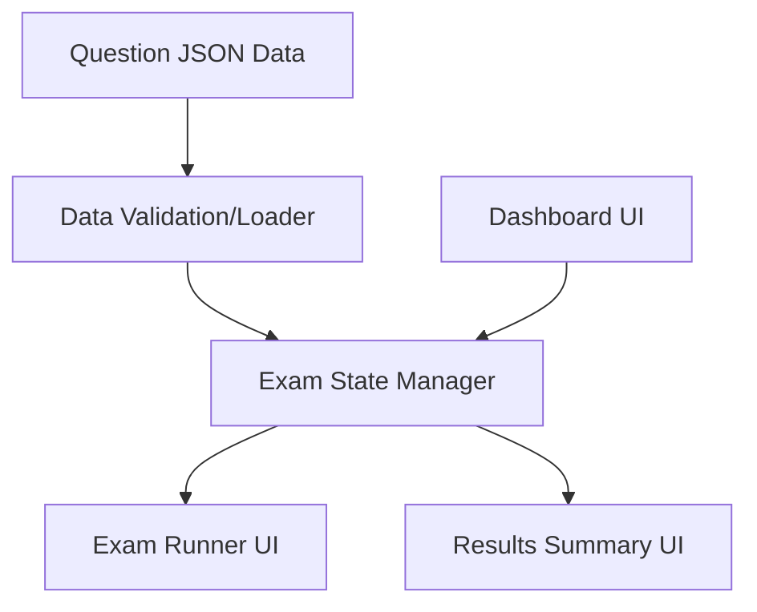

# Architecture — Airport Staff Exam Simulator (v2)

## SDLC shape
AI-Augmented Spiral-Incremental.

## System overview

**Data Flow:** The application loads static JSON files containing the question bank. A central Exam State Manager (React Context or Custom Hook) holds the active session (timer, current question index, user answers). The UI layers (Dashboard, Runner, Results) merely dispatch actions to this state manager and read from it to render.

## Key architectural decisions
| Decision | Alternative(s) rejected | Reason |
|---|---|---|
| Static JSON Question Bank | Backend API | No time to build a robust backend in 2 days. JSON ensures high performance and offline reliability during the exam. |
| Custom Validation Script | Trusting AI generation blindly | The user flagged AI hallucination in questions as the #1 problem. We will write a small Node script to schema-validate the JSON before building. |
| Vanilla React State (Hooks) | Redux / Zustand | Scope is small enough that a single `useExamSession` hook can manage timer, answers, and navigation without boilerplate. |
| Full UI Rewrite in `v2-app` | Patching existing code | The user strictly requested "not touch the existing one" and "create the new one". We will clear out the existing `src/` to build fresh but keep Vite/Tailwind configuration. |
