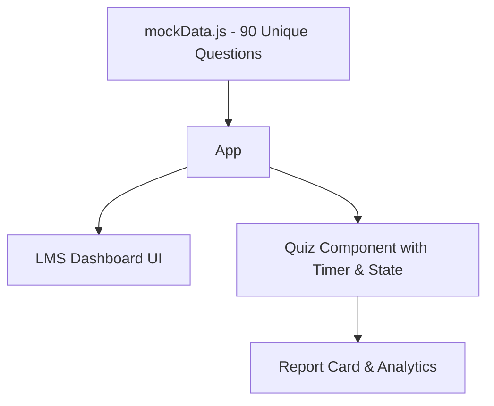

# Architecture — Bassant Exam Prep Upgrade

## SDLC shape
AI-Augmented Spiral-Incremental.

## System overview
The system is a static client-side Single Page Application (SPA) built with React and Vite. Data is bundled directly with the application to ensure it works fully offline and loads instantly. 

## Key architectural decisions
| Decision | Alternative(s) rejected | Reason |
|---|---|---|
| Hand-written JSON/JS data file | Python generator script | The Python script produced repetitive questions. A manual data file allows for highly bespoke, accurate, and truly unique Airport Ground Staff questions. |
| React Context/Redux for State | Kept simple local state / `react-router` state | The app is small enough that passing state via `react-router-dom` `state` prop from Quiz to ReportCard is sufficient and reduces boilerplate. |
| Taildwind Custom Theme | Pre-built UI library (e.g. MUI) | Tailwind is already installed and allows for faster "stunning" custom UI tweaks without adding heavy dependencies. |
